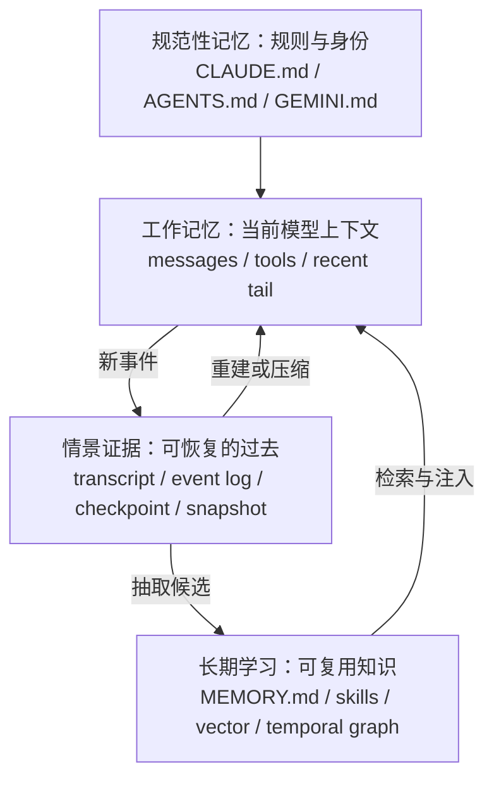
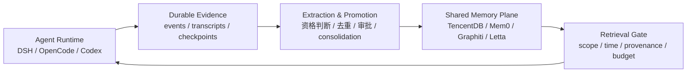

# Agent Memory 不是向量数据库：热门 Agent 的四层记忆系统调研

> **状态：已否决的第一版。** 本文研究对象偏向 coding-agent runtime，不是当前文章主体。有效研究范围与接续方式见 [HANDOFF.md](./HANDOFF.md)。保留本文仅用于复用其中关于落地现状、session persistence 与 compaction 的材料。

> 研究日期：2026-08-17。本文基于公开文档与公开仓库，研究 Claude Code、Codex、Gemini CLI、OpenCode、DeepSeek Harness、OpenClaw 与 Hermes Agent。GitHub stars 只用于说明样本热度，不用于技术排名。

## 先说结论

现在讨论 Agent memory，最大的误区是把所有“过去的信息”都叫作记忆，然后直接比较向量数据库、图数据库和 `MEMORY.md`。

但热门 Agent 的真实设计已经分成四个平面：

1. **规范性记忆**：Agent 应当如何工作，例如 `CLAUDE.md`、`AGENTS.md`、`GEMINI.md`。它解决规则、身份和项目约束。
2. **工作记忆**：当前上下文窗口里的 messages、工具结果和 recent tail。它解决这一步推理能看到什么。
3. **情景证据**：transcript、事件日志、checkpoint、snapshot。它解决会话能否恢复、重放、分叉和审计。
4. **长期学习**：Auto Memory、`MEMORY.md`、skills，以及 TencentDB Agent Memory、Mem0、Graphiti、Letta 等外部系统。它解决跨会话召回、合并、共享和治理。

这四层会互相传递信息，但不能互相替代。增大上下文窗口不能替代长期治理；保存 transcript 也不代表模型会主动回忆；向量检索更不能替代一次执行的精确恢复。

真正的趋势不是“大家终于接上向量库”，而是**开始治理一次经历如何变成长期记忆**：什么时候抽取、谁能写、是否审批、如何合并、怎样遗忘、能否追到原始证据，以及错误记忆怎样撤销。

## 七个热门 Agent，实际上在解不同的问题

| 系统 | 规则/身份 | 长期学习 | 会话证据与恢复 | 最鲜明的设计选择 |
|---|---|---|---|---|
| Claude Code | 分层 `CLAUDE.md`、rules | 每仓库 Auto Memory，`MEMORY.md` + topic files | 会话与 compaction | 人写规则和 Agent 写学习明确分开，文件可直接审计 |
| Codex | 分层 `AGENTS.md` | 本地生成式 memories，extract + consolidation | 本地会话状态与 compact | 明确把 memories 定义为 recall layer，而非强制规则源 |
| Gemini CLI | 全局/项目/目录 `GEMINI.md` | 后台从旧 transcript 生成 `.patch` 与 `SKILL.md` 候选 | shadow Git checkpoint + conversation restore | 自动学习默认关闭，候选必须由人批准 |
| OpenCode V2 | 指令源按 epoch 同步 | 主要依靠文件/扩展层 | durable messages、compaction checkpoint、Git snapshot | 活动上下文有损，但原始历史不删除 |
| DSH | system prompt 与插件配置 | 第三方 memory 走通用 MCP | append-only event log、Zstd JSONL、可审计 compaction | 把可重放会话当 OS 底座，把语义记忆留给外部能力层 |
| OpenClaw | bootstrap/workspace 文件 | `MEMORY.md` + 每日 notes + 搜索 | rolling main session、compaction 前 flush | 热记忆、冷笔记和压缩前持久化组成显式层级 |
| Hermes | system prompt + `USER.md` | 有硬字符上限的 `MEMORY.md` | session history/search | 拒绝无限增长，写满后 Agent 必须合并或删除 |

## Claude Code：记忆首先是可审计的文件

Claude Code 的官方文档把两个系统放在同一页，却刻意区分写入者：`CLAUDE.md` 由人写，Auto Memory 由 Claude 写。两者在每次会话启动时进入上下文，但都只是 context，不是强制配置；真要阻止动作，需使用 hook 或权限设置。

规则还有作用域：组织、用户、项目、本地，以及子目录按需加载。Auto Memory 则按 Git 仓库归档，多个 worktree 共享同一目录。入口 `MEMORY.md` 是精简索引，详细信息可拆到 topic files；自动进入每个会话的内容被限制为前 200 行或 25KB。

这套设计的价值不在“Markdown 很简单”，而在三个工程属性：

- 人能直接读、改、删除和 diff；
- 项目规则可跟随 Git，个人学习保持机器本地；
- 用索引 + 按需读取控制 prompt 成本。

边界也很明显：文件没有天然的时间有效性、实体冲突和多写者一致性。文档甚至提醒，冲突规则可能被任意选择，过长文件会降低遵循率。因此它适合单机、单用户、以项目为中心的 Agent；进入多人共享、跨设备或强审计环境后，就需要额外的治理层。

来源：[Claude Code memory 官方文档](https://code.claude.com/docs/en/memory)。

## Codex：规则是规则，回忆是回忆

Codex 的设计给了一个很清楚的原则：**必须遵守的团队指导放进 `AGENTS.md` 或版本库文档；memories 只是有帮助的 recall layer。**

本地 memories 默认关闭。开启后，Codex 会从符合条件的旧会话生成本地记忆文件，跳过仍活跃或太短的会话，并在后台更新，而不是在聊天结束时立即写。生成过程还可因剩余配额过低而跳过。配置进一步拆开 `generate_memories` 和 `use_memories`，并提供 extract model 与 consolidation model；如果会话使用了 MCP、网页搜索或工具搜索，也可以排除其进入记忆生成。

这个 `disable_on_external_context` 很值得写进文章。它反映的不是一个小开关，而是 provenance 风险：外部网页和工具返回值可能短期有效、被污染或包含不应长期固化的内容。成熟系统开始问“这个会话有没有资格成为训练未来自己的材料”。

Codex 的本地目录包含 summaries、durable entries、recent inputs 和 supporting evidence。把“证据”保留下来，也说明长期记忆不应只是孤立的一句话；以后要纠错，至少应能追溯它从哪些会话中得出。

来源：[Codex memories 官方文档](https://learn.chatgpt.com/docs/customization/memories)、[Codex AGENTS.md 官方文档](https://learn.chatgpt.com/docs/agent-configuration/agents-md)。

## Gemini CLI：自动记忆先进入候选箱，不直接改大脑

Gemini CLI 的 Auto Memory 更像一条受控的数据管道。它当前是实验功能，默认关闭。服务在后台扫描本地旧会话，只有空闲至少三小时且包含至少十条用户消息的 session 才有资格；活跃、琐碎和 sub-agent session 被忽略。

它不会直接修改生效中的记忆，而是生成两类候选：

- 用 unified diff `.patch` 表达的 memory update；
- 可复用流程的 `SKILL.md` 草稿。

候选进入项目本地 inbox，用户可以批准、提升或丢弃。并发 CLI 由 lock file 协调，state file 记录已处理的会话版本，避免重复抽取。补丁还要经过路径 allowlist、dry-run 与原子应用。

这套流程首次把“事实记忆”和“程序性记忆”一起处理：重复出现的偏好、约束进入 memory；可复用的操作过程提升成 skill。它比“把全部对话 embedding 后搜索”更接近真正的知识工程。

Gemini 的 checkpointing 又是另一条线：在工具修改文件前，用 shadow Git repo 保存项目快照，同时记录对话历史和工具调用；恢复时可以还原文件、对话，并重新提出对应工具调用。它解决的是执行回滚，不是长期学习。这正好证明 session state 与 semantic memory 不能混为一谈。

来源：[Gemini CLI Auto Memory](https://geminicli.com/docs/cli/auto-memory/)、[Gemini CLI checkpointing](https://geminicli.com/docs/cli/checkpointing/)、[Gemini CLI memory management](https://geminicli.com/docs/cli/tutorials/memory-management/)。

## OpenCode：摘要可以有损，但历史不能假装没发生

OpenCode V2 把 compaction 定义成“用 checkpoint 替换活动模型上下文中较老的一段”。checkpoint 包含结构化 summary 和序列化的 recent tail。后续模型请求从最新完成 checkpoint 与其后的消息重新组装。

关键在于：compaction 有损，但不会删除之前的 durable session messages。运行中和失败的 compaction 不进入模型上下文；完成的 checkpoint 作为历史对话呈现，并明确不是新指令。旧记录仍可用于审计，即使模型当前看不到。

OpenCode 还把文件 snapshot 分离出来。每个模型 step 前后尝试把工作树存进独立 Git object database，回滚对话时可恢复相关路径。但文档明确承认它不能撤销数据库、服务、进程、网络资源、Git 状态和目录外文件的副作用。

这比“有一个撤销按钮”更真实：Agent 的执行状态从来不只在 prompt 里。一个可靠的 Agent OS 必须标注恢复边界，而不是把 summary、文件快照和外部世界混成“记忆”。

来源：[OpenCode V2 compaction](https://opencode.ai/v2/docs/compaction)、[OpenCode V2 snapshots](https://opencode.ai/v2/docs/snapshots)。

## DSH：它的 memory 底座是 event sourcing

如果说前面几个产品从用户体验出发，DSH 则直接暴露了运行时骨架。

DSH 的 `Session` 是 typed `SessionEvent` 的 append-only log，也是唯一真相源。模型消息由 `deriveMessages()` 从日志派生；raw stream chunk 用于 token 级 replay，组装后的 `assistant/message` 才是消息投影的权威记录。fork 与 replay 的本质，是用既有日志为新 session 播种。

它把 I/O 从热路径移走：append 同步发生，持久化插件 write-behind，在每个 turn 结束时通过可等待的 flush 落盘。默认 JSONL 后端进一步使用 Zstandard：header 独占一帧，每个 durable append batch 独占一帧。于是 frame boundary 同时承担压缩、checksum、fsync commit 和 torn-tail crash repair 的边界。

DSH 的 compaction 也不是悄悄覆盖一段数组。它记录 `compaction/start`、`compaction/summary`、用于替换 surface 的消息，以及最后的 `compaction/end`。如果中途崩溃，只有 start 没有 end 会留下可检测的孤儿锁；summary 还记录被遮蔽范围、seq、token、provider、model 和 usage。模型看到的是压缩后的 surface，系统仍保留生成它的证据。

最重要的是，DSH 没把跨会话语义记忆硬塞进核心。官方仓库给 Memorix、Reference Memory 和 Engram 提供默认关闭的 MCP overlay 示例，但明确把账号、模型、embedding、存储初始化、迁移、重试和故障恢复留给上游 provider 或用户。它支持 memory，却拒绝把某一家的语义抽取模型变成 Agent loop 的固定组成。

所以 DSH 更像 Agent OS 底座：原生保证“过去能被重放和解释”，长期记忆则是可插拔能力。这与 TencentDB Agent Memory 并不竞争；前者是运行时证据层，后者可以成为共享知识与治理层。

来源：[DSH event-sourced sessions](https://raw.githubusercontent.com/deepseek-ai/deepseek-harness/99f6f02fecdb7dff40c3fbc9470f5907c29f74ca/.agents/notes/implemented/architecture/2026-06-11-event-sourced-sessions.md)、[DSH compaction](https://raw.githubusercontent.com/deepseek-ai/deepseek-harness/99f6f02fecdb7dff40c3fbc9470f5907c29f74ca/docs/subsystems/compaction.md)、[DSH Zstandard JSONL](https://raw.githubusercontent.com/deepseek-ai/deepseek-harness/99f6f02fecdb7dff40c3fbc9470f5907c29f74ca/.agents/notes/implemented/architecture/2026-07-19-zstandard-jsonl-session-logs.md)、[DSH third-party memory MCP examples](https://raw.githubusercontent.com/deepseek-ai/deepseek-harness/99f6f02fecdb7dff40c3fbc9470f5907c29f74ca/.agents/notes/implemented/feature/2026-07-31-third-party-memory-mcp-examples.md)。

## OpenClaw 与 Hermes：文件记忆也有两条路线

OpenClaw 采用冷热分层。精选事实进入 `MEMORY.md`，每日日志进入 `memory/YYYY-MM-DD.md`；今天和昨天的 notes 可被自动装载，较老内容通过搜索读取。上下文接近压缩前，系统还会进行一次静默 memory flush，把值得长期保存的事实写盘，再对当前会话做 summary。这是“先落事实，再压上下文”。

Hermes 更激进地限制规模：`MEMORY.md` 与 `USER.md` 有硬字符上限，在 session 启动时作为冻结快照注入。写入超限会失败，Agent 必须先合并或删除。它没有假装记忆可以无限增长，而是把遗忘变成系统契约。

两者共同说明：文件不只是廉价替代品。只要有明确作用域、预算、冷热层、搜索和压缩策略，它可以是一套可用的个人 Agent memory。但它们也暴露共同难题：谁判断事实过期？两个 Agent 同时写怎么办？如何保留来源与版本？这些才是外部 memory infrastructure 的机会。

来源：[OpenClaw memory](https://docs.openclaw.ai/concepts/memory)、[OpenClaw main session](https://docs.openclaw.ai/concepts/main-session)、[Hermes memory](https://hermes-agent.nousresearch.com/docs/user-guide/features/memory/)。

## 为什么它们没有一上来就内置向量数据库

对 coding agent，最先要解决的不是“在十万条事实中相似搜索”，而是以下问题：

- 当前规则是否明确、可版本化？
- 工具调用发生后，系统能否恢复到一致状态？
- context overflow 时，哪些内容被丢弃，原始证据是否仍在？
- 一次失败是否会被错误提炼成永久偏好？
- 多个项目、worktree、用户和 Agent 的作用域如何隔离？

Markdown、event log 和 checkpoint 的优势是确定、透明、便宜并且容易进入 Git 或本地文件系统。向量检索解决的是另一类问题：当知识量超过 prompt、需要语义召回或跨用户共享时，怎样在候选集合中找到相关信息。

如果底层会话连可重放性都没有，接再好的向量数据库也只是让 Agent 更快地找到一条可能错误的总结。

## TencentDB Agent Memory 应该放在哪里

你之前的 TencentDB Agent Memory 报告已经覆盖了 Chat Memory、Skill、Wiki、CodeGraph，以及统一 metadata、binding 与治理。新文章不应再重复“它比向量数据库多哪些功能”，而应回答它和 Agent runtime 的接缝。

一个合理的组合是：

运行时负责精确事件、执行状态、压缩和恢复；外部记忆层负责跨 session、跨 Agent、跨设备的知识抽取、检索、版本、权限和治理。中间的 extraction/promotion pipeline 决定什么能从“发生过”升级为“以后应该记住”。

TencentDB 的真正卖点因而不是替换 `MEMORY.md`，而是在文件方案开始失效时提供控制面：

- 多 Agent/多人共享与权限隔离；
- 时间有效性、版本和 provenance；
- Chat、Skill、Wiki、CodeGraph 的统一绑定；
- 大规模知识的语义与结构检索；
- 删除、过期、审计与成本治理。

## 目前主流设计仍没解决好的问题

### 1. 错误会被“巩固”

summary 和抽取模型都可能把一次偶然修复写成通用规律。之后每次注入又提高它的可信度，形成错误自强化。审批能降低风险，但会带来维护负担；全自动写入更顺滑，却更容易污染。

### 2. 遗忘通常只是删文件

大多数系统有大小限制或手工删除，却缺少基于时间、置信度、使用频率和事实冲突的系统性遗忘。Graphiti 的 temporal invalidation 是一个方向，但成本和复杂度更高。

### 3. 来源仍然太弱

“用户偏好 pnpm”应该能回答：用户何时说的、在哪个项目、是否已被后续行为推翻。只有 value 没有 evidence 的记忆，很难安全纠正。

### 4. 并发与共享会破坏文件模型

多个 sub-agent、worktree 或设备可能同时更新同一记忆。lock 能解决单机抽取互斥，却不能自动解决语义冲突和跨设备同步。

### 5. Memory eval 仍不成熟

常见 benchmark 测“隔很久还能否答出某事实”，但真实开发更关心：过期事实会不会被遗忘、错误会不会固化、规则冲突如何处理、恢复后文件与对话是否一致，以及每次召回花多少 token。

## 建议做一套真正有内容的实验

如果把这篇调研写成网站的代表作，最好不止停在文档对比。可以给 Claude Code、Codex、Gemini CLI、OpenClaw 与 Hermes 喂同一套“30 天项目演进”剧本：

1. 第 1 天声明用 npm；第 8 天迁移到 pnpm，测试旧事实是否失效。
2. 第 3 天故意给出错误构建命令，第 4 天纠正，测试污染与纠错。
3. 在两个 worktree 中给出冲突偏好，测试 scope 与并发。
4. 让会话跨过多次 compaction，检查规则、未完成任务和文件路径的保真度。
5. 中途终止工具调用，恢复 session，检查对话、文件与外部副作用是否一致。
6. 让一个 Agent 写 memory，另一个 fresh session 召回，测跨会话成功率。
7. 记录每轮注入 token、后台抽取调用、人工审批次数和最终错误率。

最终指标不只是 recall@k，而应至少包括：

- durable fact recall；
- stale fact rejection；
- correction latency；
- false consolidation rate；
- provenance coverage；
- recovery consistency；
- prompt token overhead；
- human maintenance cost。

## 最终判断

2026 年主流 Agent memory 的分水岭，已经不是“文件还是向量库”。真正的架构差异是：

- 是否把规则、会话状态和长期学习分开；
- 是否保存可重建的原始证据；
- 是否让记忆写入经过资格判断与安全门；
- 是否有明确预算、合并与遗忘机制；
- 是否能在个人本地记忆与组织共享控制面之间建立干净边界。

因此，最值得写的文章不是又一篇 memory 产品功能表，而是解释一个反常识结论：**Agent 的第一层记忆不是向量数据库，而是一套可审计、可恢复、可遗忘的状态生命周期。**

这也给你的网站形成了非常好的连续选题：先用这篇建立四层框架，再分别深挖 DSH 的 event sourcing、Gemini/Codex 的后台 consolidation，以及 TencentDB 如何承接共享治理层。这样既能复用旧报告，又不会重复旧报告。
